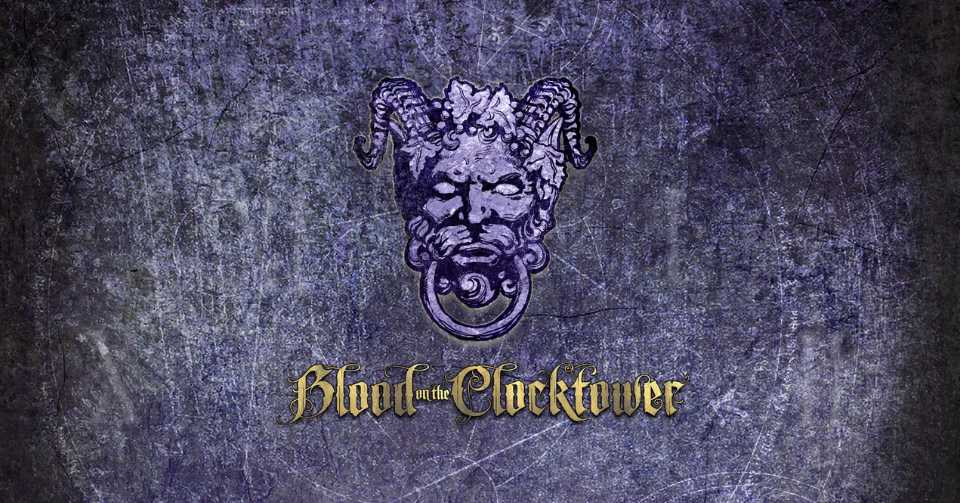
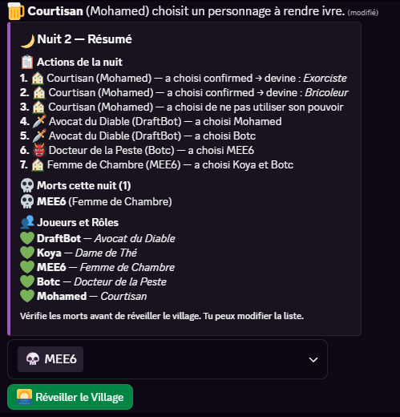
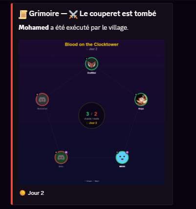
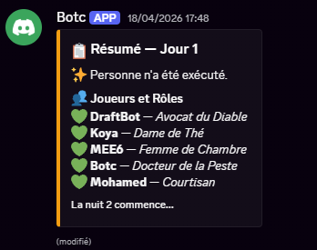
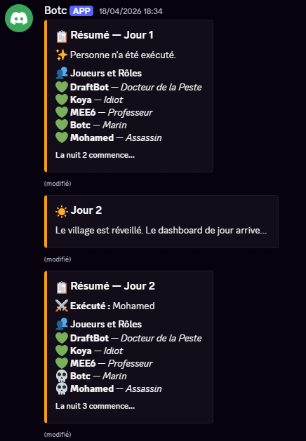

# Blood on the Clocktower - Discord Bot



Un bot Discord complet, développé en TypeScript, dédié à l'automatisation et la gestion des parties du jeu de rôle **Blood on the Clocktower**. Ce bot a été conçu pour faciliter considérablement le travail du Maître du Jeu (MJ) en automatisant les actions de nuit, la gestion du grimoire, et les interactions des joueurs.

## Fonctionnalités Principales

* **Night Engine (Moteur de Nuit) :** Un système avancé qui gère automatiquement l'ordre des actions de la nuit. Il guide le MJ étape par étape et permet des interactions fluides avec les joueurs (ex: confirmations de cibles pour l'Assassin).
  
  > **Exemple d'une nuit guidée pour le Maître du Jeu :**
  >
  >  

* **Gestion du Grimoire :** Interface permettant de visualiser et manipuler le grimoire de la partie en temps réel.
  
  > **Visualisation de l'état de la partie (Le Grimoire) :**
  >
  > 

* **Dashboard Interactif & Suivi :** Des panneaux de contrôle interactifs (Boutons, Menus, Modals) en messages privés et sur le serveur pour une expérience utilisateur optimale sans commandes textuelles fastidieuses.
  
  > **Résumé des journées et rôles :**
  >
  > 
  > 
  > **Évolution des nuits et morts au fil des tours :**
  >
  >  

* **Attribution des Rôles :** Distribution automatique et sécurisée des rôles aux participants en début de partie.
* **Base de données :** Suivi des statistiques et de l'état des parties en cours.

## Stack Technique

* **Langage :** [TypeScript](https://www.typescriptlang.org/)
* **Librairie Discord :** [Discord.js](https://discord.js.org/) (v14)
* **Base de Données :** [Prisma](https://www.prisma.io/) avec SQLite
* **Environnement :** Node.js

## Installation & Lancement

1. **Cloner le repository :**
   ```bash
   git clone https://github.com/Git-MohamedB/BOTC.git
   cd BOTC
   ```

2. **Installer les dépendances :**
   ```bash
   npm install
   ```

3. **Configuration :**
   * Copier le fichier `.env.example` en `.env`.
   * Remplir les variables d'environnement (Token du bot, ID du serveur, etc.).
   
4. **Initialiser la base de données :**
   ```bash
   npx prisma generate
   npx prisma db push
   ```

5. **Déployer les commandes (Slash Commands) :**
   ```bash
   npm run deploy
   ```

6. **Lancer le bot :**
   ```bash
   npm run dev
   ```

## Licence

Ce projet est réalisé à titre personnel. Les droits du jeu *Blood on the Clocktower* appartiennent à The Pandemonium Institute.
